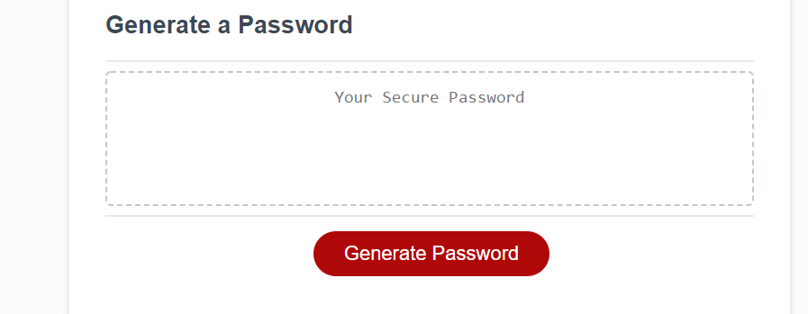

# Password Generator

## Summary
#### The program ask user a series of question before generating a password. question includes password length, Uppercase, Lowercase, Numbers and Special Characters.

## Techonolgies
#### HTML , CSS and Javascrit

## Instalation/Website
#### https://szali3.github.io/password-generator/

## Contributor
#### Zohaib Ali
